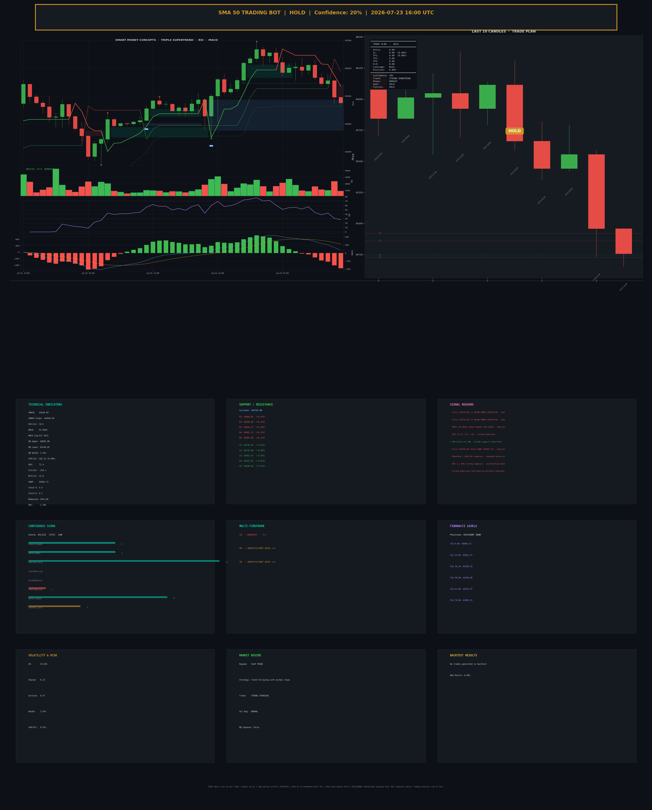

this bot create by toobit engine
for docs toobit engine please read this api document please

[Toobit SDK](https://api-docs.toobit.com/agent)


the example data metadata and output

```json
/// Candles.json
[
  {
    "open_time": 1784764800000,
    "open": "66114.5",
    "high": "66311.11",
    "low": "65585.11",
    "close": "65662.53",
    "volume": "1614.24808",
    "ignore": 0,
    "quote_volume": "106408071.0292638",
    "trades": 17744,
    "taker_buy_volume": "922.8139",
    "taker_buy_quote_volume": "60816328.8879604"
  },
  {
    "open_time": 1784779200000,
    "open": "65662.53",
    "high": "65821.17",
    "low": "65351.02",
    "close": "65442.13",
    "volume": "1150.79393",
    "ignore": 0,
    "quote_volume": "75494101.62449",
    "trades": 17780,
    "taker_buy_volume": "632.18099",
    "taker_buy_quote_volume": "41471427.5248862"
  },
  {
    "open_time": 1784793600000,
    "open": "65442.13",
    "high": "65792.09",
    "low": "65419.75",
    "close": "65555.22",
    "volume": "1041.86821",
    "ignore": 0,
    "quote_volume": "68379080.265127",
    "trades": 22750,
    "taker_buy_volume": "572.91899",
    "taker_buy_quote_volume": "37601626.6238095"
  },
  {
    "open_time": 1784808000000,
    "open": "65555.22",
    "high": "65589.41",
    "low": "64728",
    "close": "64958.36",
    "volume": "2396.15725",
    "ignore": 0,
    "quote_volume": "155854747.0496521",
    "trades": 32156,
    "taker_buy_volume": "1350.3885",
    "taker_buy_quote_volume": "87823999.1022445"
  },
  {
    "open_time": 1784822400000,
    "open": "64958.36",
    "high": "64961.15",
    "low": "64651.67",
    "close": "64772.31",
    "volume": "914.46803",
    "ignore": 0,
    "quote_volume": "59256292.6354466",
    "trades": 16869,
    "taker_buy_volume": "474.93877",
    "taker_buy_quote_volume": "30775739.1147432"
  }
]
```

candles output pic


SMA 20 :
Pic output:


json file 

```json
/// MetaData Output
{
  "analysis_time": "2026-07-23T19:37:30.338595+00:00",
  "signal": {
    "type": "HOLD",
    "confidence": 30,
    "spot_action": "HOLD",
    "futures_action": "HOLD",
    "leverage_suggestion": "None",
    "entry_price": 0.0,
    "stop_loss": 0.0,
    "take_profit_1": 0.0,
    "take_profit_2": 0.0,
    "take_profit_3": 0.0,
    "risk_reward_ratio": 0.0,
    "position_size_pct": 0.0,
    "trend_direction": "STRONG DOWNTREND",
    "market_phase": "MARKUP",
    "reasons": [
      "Price (64756.00) is BELOW SMA20 (65814.96) - bearish bias",
      "Price (64756.00) is BELOW SMA20 (65814.96) - bearish bias",
      "SMA20 slope turning negative (-12.30) - potential reversal",
      "MACD (91.6926) below Signal (537.3651) - bearish momentum",
      "ADX (71.4) -DI > +DI - strong downtrend",
      "OBV below its SMA - volume supports downtrend",
      "Price (64756.00) below VWAP (64944.72) - bearish",
      "Momentum (-1454.00) negative - downward pressure",
      "ROC (-2.20%) strong negative - accelerating down",
      "Strong downtrend confirmed by multiple indicators"
    ],
    "warnings": [
      "Low volatility - breakout may be imminent"
    ],
    "support_levels": [
      64746.85371533888,
      64728.0,
      64651.67,
      64422.015,
      64280.96
    ],
    "resistance_levels": [
      64860.01700000001,
      64944.7194210763,
      64961.15,
      64965.86,
      65107.99
    ],
    "patterns_detected": []
  },
  "indicators": {
    "SMA20": "65814.96",
    "SMA20 Slope": "-12.30",
    "RSI(14)": "39.54",
    "MACD": "91.6926",
    "MACD Signal": "537.3651",
    "MACD Histogram": "-445.6726",
    "BB Upper": "66883.06",
    "BB Lower": "64746.85",
    "BB Width": "3.25%",
    "ATR(14)": "582.22",
    "ATR %": "0.90%",
    "Stoch K": "4.53",
    "Stoch D": "9.20",
    "ADX": "71.43",
    "+DI": "0.00",
    "-DI": "13.11",
    "CCI(20)": "-158.13",
    "MFI(14)": "32.78",
    "Williams %R": "-95.47",
    "VWAP": "64944.72",
    "Momentum": "-1454.00",
    "ROC": "-2.20%",
    "OBV Trend": "Down",
    "Volume Ratio": "0.55",
    "Buy Pressure": "51.84%"
  },
  "volume_analysis": "Current Volume: 934.44\nAverage Volume: 1697.61\nVolume Ratio: 0.55x\nBuy Pressure: 51.8%\nVolume Trend: LOW\nDivergence: NONE\nAccumulation: YES\nDistribution: NO",
  "multi_timeframe": {
    "1H": {
      "trend": "BEARISH",
      "signal": "SELL",
      "sma20": 65814.955,
      "rsi": 39.54181888403456
    },
    "4H": {
      "trend": "INSUFFICIENT DATA",
      "signal": "HOLD",
      "sma20": 0,
      "rsi": 50
    },
    "1D": {
      "trend": "INSUFFICIENT DATA",
      "signal": "HOLD",
      "sma20": 0,
      "rsi": 50
    }
  },
  "market_regime": {
    "regime": "CALM TREND",
    "strategy": "Trend following with normal stops"
  },
  "volatility": {
    "historical_volatility": 10.02,
    "sharpe_ratio": 0.23,
    "max_drawdown_pct": 3.97
  },
  "confidence": {
    "pct": 37.4,
    "rating": "LOW",
    "factors": {
      "trend_strength": 5,
      "market_phase": 5,
      "indicator_alignment": 11,
      "candlestick_patterns": 0,
      "volume_analysis": 0,
      "timeframe_alignment": 1,
      "market_regime": 8,
      "fibonacci_position": 3,
      "wave_structure": 5,
      "order_flow": 2,
      "risk_metrics": 3
    }
  },
  "backtest": {
    "total_return_pct": 0.0,
    "win_rate": 0,
    "profit_factor": Infinity,
    "max_drawdown": 0.0,
    "total_trades": 0
  }
}
```

```text
AI Output
======================================================================
         SMA 20 TRADING BOT - COMPLETE ANALYSIS REPORT
======================================================================

  Analysis Time: 2026-07-23 19:37:30 UTC
  Last Candle:   2026-07-23 16:00 UTC
  Candles Used:  50

----------------------------------------------------------------------
  CURRENT MARKET DATA
----------------------------------------------------------------------
  Open:    64958.36
  High:    64961.15
  Low:     64651.67
  Close:   64756.00
  Volume:  934.44
  Range:   309.48
  Body:    202.36 (Bearish)
  Buy Pressure: 51.8%

----------------------------------------------------------------------
  SIGNAL SUMMARY
----------------------------------------------------------------------
  >>> OVERALL SIGNAL: HOLD <<<
  Confidence:       30.0%
  Trend Direction:  STRONG DOWNTREND
  Market Phase:     MARKUP

----------------------------------------------------------------------
  TRADING ACTIONS
----------------------------------------------------------------------
  SPOT:    HOLD
  FUTURES: HOLD

----------------------------------------------------------------------
  SUPPORT & RESISTANCE LEVELS
----------------------------------------------------------------------
  Resistance Levels:
    R1: 64860.02 (+0.16%)
    R2: 64944.72 (+0.29%)
    R3: 64961.15 (+0.32%)
    R4: 64965.86 (+0.32%)
    R5: 65107.99 (+0.54%)
  Support Levels:
    S1: 64746.85 (-0.01%)
    S2: 64728.00 (-0.04%)
    S3: 64651.67 (-0.16%)
    S4: 64422.01 (-0.52%)
    S5: 64280.96 (-0.73%)

----------------------------------------------------------------------
  TECHNICAL INDICATORS
----------------------------------------------------------------------
  SMA20               : 65814.96
  SMA20 Slope         : -12.30
  RSI(14)             : 39.54
  MACD                : 91.6926
  MACD Signal         : 537.3651
  MACD Histogram      : -445.6726
  BB Upper            : 66883.06
  BB Lower            : 64746.85
  BB Width            : 3.25%
  ATR(14)             : 582.22
  ATR %               : 0.90%
  Stoch K             : 4.53
  Stoch D             : 9.20
  ADX                 : 71.43
  +DI                 : 0.00
  -DI                 : 13.11
  CCI(20)             : -158.13
  MFI(14)             : 32.78
  Williams %R         : -95.47
  VWAP                : 64944.72
  Momentum            : -1454.00
  ROC                 : -2.20%
  OBV Trend           : Down
  Volume Ratio        : 0.55
  Buy Pressure        : 51.84%

----------------------------------------------------------------------
  VOLUME ANALYSIS
----------------------------------------------------------------------
Current Volume: 934.44
Average Volume: 1697.61
Volume Ratio: 0.55x
Buy Pressure: 51.8%
Volume Trend: LOW
Divergence: NONE
Accumulation: YES
Distribution: NO

----------------------------------------------------------------------
  SIGNAL REASONS
----------------------------------------------------------------------
   1. Price (64756.00) is BELOW SMA20 (65814.96) - bearish bias
   2. Price (64756.00) is BELOW SMA20 (65814.96) - bearish bias
   3. SMA20 slope turning negative (-12.30) - potential reversal
   4. MACD (91.6926) below Signal (537.3651) - bearish momentum
   5. ADX (71.4) -DI > +DI - strong downtrend
   6. OBV below its SMA - volume supports downtrend
   7. Price (64756.00) below VWAP (64944.72) - bearish
   8. Momentum (-1454.00) negative - downward pressure
   9. ROC (-2.20%) strong negative - accelerating down
  10. Strong downtrend confirmed by multiple indicators

----------------------------------------------------------------------
  RISK WARNINGS
----------------------------------------------------------------------
  WARNING: Low volatility - breakout may be imminent

----------------------------------------------------------------------
  RISK MANAGEMENT GUIDELINES
----------------------------------------------------------------------
  HOLD signal - no active trade recommended
  Wait for clearer signal before entering any position
  Monitor key support/resistance levels for breakout

----------------------------------------------------------------------
  SPOT TRADING NOTES
----------------------------------------------------------------------
  - No action recommended for spot trading
  - Hold existing positions
  - Wait for clearer entry/exit signal

======================================================================
  DISCLAIMER: This is technical analysis for educational purposes
  only. Trading involves significant risk. Always do your own
  research and never invest more than you can afford to lose.
======================================================================

======================================================================
         ENHANCED ANALYSIS - ADVANCED METRICS
======================================================================

----------------------------------------------------------------------
  MULTI-TIMEFRAME ANALYSIS
----------------------------------------------------------------------
  1H  : BEARISH    <<< SMA20=65814.96 RSI=39.5 MACD=91.6926 Signal=SELL
  4H  : INSUFFICIENT DATA === SMA20=0.00 RSI=50.0 MACD=0.0000 Signal=HOLD
  1D  : INSUFFICIENT DATA === SMA20=0.00 RSI=50.0 MACD=0.0000 Signal=HOLD
  HTF Alignment: MODERATE_BEARISH (33%)

----------------------------------------------------------------------
  FIBONACCI ANALYSIS
----------------------------------------------------------------------
    Fib 0.0%    : 66956.15
    Fib 23.6%   : 65913.37
    Fib 38.2%   : 65268.25
    Fib 50.0%   : 64746.86
    Fib 61.8%   : 64225.47
    Fib 78.6%   : 63483.15
    Fib 100.0%  : 62537.57
  Extensions:
    Ext 127.2%  : 68158.00
    Ext 161.8%  : 69686.83
    Ext 200.0%  : 71374.73
    Ext 261.8%  : 74105.41
    Ext 361.8%  : 78523.99
  Price Position: DISCOUNT ZONE

----------------------------------------------------------------------
  ELLIOTT WAVE ANALYSIS
----------------------------------------------------------------------
  Pattern:  EXTENDED WAVE (8-wave)
  Direction: UP
  Confidence: 80%
  Swings:   8

----------------------------------------------------------------------
  VOLATILITY & RISK METRICS
----------------------------------------------------------------------
  Historical Volatility: 10.02%
  Sharpe Ratio:         0.23
  Sortino Ratio:        0.47
  Max Drawdown:         3.97%
  Current Drawdown:     2.88%
  VaR (95%):            0.91%

----------------------------------------------------------------------
  MARKET STRUCTURE & ORDER FLOW
----------------------------------------------------------------------
  Buy Volume Ratio:   47.5%
  Sell Volume Ratio:  52.5%
  Flow Bias:          BALANCED
  Activity Level:     NORMAL
  Max Consec Bullish: 5
  Max Consec Bearish: 2
  Large Bars:         1
  Small Bars:         1
  High Volume Node:   64172.00
  Low Volume Node:    62537.57
  Price Efficiency:   4.8% (LOW)
  Net Price Move:     -246.01

----------------------------------------------------------------------
  MARKET REGIME
----------------------------------------------------------------------
  Current Regime:     CALM TREND
  Strategy:           Trend following with normal stops
  Trend Regime:       STRONG TRENDING
  Volatility Regime:  NORMAL
  Volume Regime:      NORMAL
  BB Squeeze:         NO
  Price Range (20):   4.44%

----------------------------------------------------------------------
  ADVANCED CHART PATTERNS
----------------------------------------------------------------------
  - DOUBLE TOP (BEARISH) [CONFIRMED]
    Target: 64151.87
    Neckline: 65554.01
  - HEAD & SHOULDERS (BEARISH) [CONFIRMED]
    Target: 63127.15
    Neckline: 65041.65
  - RISING WEDGE (BEARISH) [FORMING]

----------------------------------------------------------------------
  COMPREHENSIVE CONFIDENCE SCORE
----------------------------------------------------------------------
  Overall Score: 43/115
  Confidence:    37.4%
  Rating:        LOW
  Factor Breakdown:
    Trend Strength           : 5
    Market Phase             : 5
    Indicator Alignment      : 11
    Candlestick Patterns     : 0
    Volume Analysis          : 0
    Timeframe Alignment      : 1
    Market Regime            : 8
    Fibonacci Position       : 3
    Wave Structure           : 5
    Order Flow               : 2
    Risk Metrics             : 3

----------------------------------------------------------------------
  PIVOT POINTS ANALYSIS
----------------------------------------------------------------------
  Type            Pivot         R1         R2         R3         S1         S2         S3
  Standard     64789.61   64927.54   65099.09   65237.02   64618.06   64480.13   64308.58
  Fibonacci    64789.61   64907.83   64980.87   65099.09   64671.39   64598.35   64480.13
  Woodie       64882.39   65113.10   65191.87        N/A   64803.62   64572.90        N/A
  Camarilla         N/A   64784.37   64812.74   64841.11   64727.63   64699.26   64670.89

  Camarilla R4: 64926.21 | Camarilla S4: 64585.79

======================================================================
         BACKTEST RESULTS - SMA 20 STRATEGY
======================================================================

  Initial Capital:    $10,000.00
  Final Capital:      $10,000.00
  Total Return:       0.00%
  Buy & Hold Return:  0.08%
  Alpha (Excess):     -0.08%

----------------------------------------------------------------------
  TRADE STATISTICS
----------------------------------------------------------------------
  Total Trades:       0
  Winning Trades:     0
  Losing Trades:      0
  Win Rate:           0.0%
  Profit Factor:      inf

----------------------------------------------------------------------
  RISK METRICS
----------------------------------------------------------------------
  Total Profit:       $0.00
  Total Loss:         $0.00
  Avg Profit/Trade:   $0.00
  Avg Loss/Trade:     $0.00
  Max Drawdown:       0.00%
  Sharpe Ratio:       0.00
  Commission:         0.10%

======================================================================
======================================================================
         ALERTS & NOTIFICATIONS
======================================================================

  [!!!] HIGH   | RISK_WARNING
       Message: Low volatility - breakout may be imminent
       Action:  CAUTION

  [!] MEDIUM | BOLLINGER
       Message: Price near lower Bollinger Band (64746.85)
       Action:  POTENTIAL BOUNCE

  [!] MEDIUM | STRONG_TREND
       Message: Strong trend detected (ADX: 71.4) direction: DOWN
       Action:  FOLLOW DOWN TREND

======================================================================
```

and PDF To but we cant export it

SMA 50 :
Pic output:



json file 

```json
/// MetaData Output
{
  "analysis_time": "2026-07-23T19:44:58.733203+00:00",
  "signal": {
    "type": "HOLD",
    "confidence": 20,
    "spot_action": "HOLD",
    "futures_action": "HOLD",
    "leverage_suggestion": "None",
    "entry_price": 0.0,
    "stop_loss": 0.0,
    "take_profit_1": 0.0,
    "take_profit_2": 0.0,
    "take_profit_3": 0.0,
    "risk_reward_ratio": 0.0,
    "position_size_pct": 0.0,
    "trend_direction": "STRONG DOWNTREND",
    "market_phase": "MARKUP",
    "reasons": [
      "Price (64756.00) is BELOW SMA50 (64920.69) - bearish bias",
      "Price (64756.00) is BELOW SMA50 (64920.69) - bearish bias",
      "MACD (91.6926) below Signal (537.3651) - bearish momentum",
      "ADX (71.4) -DI > +DI - strong downtrend",
      "OBV below its SMA - volume supports downtrend",
      "Price (64756.00) below VWAP (64944.72) - bearish",
      "Momentum (-1454.00) negative - downward pressure",
      "ROC (-2.20%) strong negative - accelerating down",
      "Strong downtrend confirmed by multiple indicators"
    ],
    "warnings": [
      "Low volatility - breakout may be imminent"
    ],
    "support_levels": [
      64746.85371533888,
      64728.0,
      64651.67,
      64422.015,
      64280.96
    ],
    "resistance_levels": [
      64860.01700000001,
      64920.6866,
      64944.7194210763,
      64961.15,
      64965.86
    ],
    "patterns_detected": []
  },
  "indicators": {
    "SMA50": "64920.69",
    "SMA50 Slope": "64920.69",
    "RSI(14)": "39.54",
    "MACD": "91.6926",
    "MACD Signal": "537.3651",
    "MACD Histogram": "-445.6726",
    "BB Upper": "66883.06",
    "BB Lower": "64746.85",
    "BB Width": "3.25%",
    "ATR(14)": "582.22",
    "ATR %": "0.90%",
    "Stoch K": "4.53",
    "Stoch D": "9.20",
    "ADX": "71.43",
    "+DI": "0.00",
    "-DI": "13.11",
    "CCI(20)": "-158.13",
    "MFI(14)": "32.78",
    "Williams %R": "-95.47",
    "VWAP": "64944.72",
    "Momentum": "-1454.00",
    "ROC": "-2.20%",
    "OBV Trend": "Down",
    "Volume Ratio": "0.55",
    "Buy Pressure": "51.84%"
  },
  "volume_analysis": "Current Volume: 934.44\nAverage Volume: 1697.61\nVolume Ratio: 0.55x\nBuy Pressure: 51.8%\nVolume Trend: LOW\nDivergence: NONE\nAccumulation: YES\nDistribution: NO",
  "multi_timeframe": {
    "1H": {
      "trend": "BEARISH",
      "signal": "SELL",
      "sma50": 64920.6866,
      "rsi": 39.54181888403456
    },
    "4H": {
      "trend": "INSUFFICIENT DATA",
      "signal": "HOLD",
      "sma50": 0,
      "rsi": 50
    },
    "1D": {
      "trend": "INSUFFICIENT DATA",
      "signal": "HOLD",
      "sma50": 0,
      "rsi": 50
    }
  },
  "market_regime": {
    "regime": "CALM TREND",
    "strategy": "Trend following with normal stops"
  },
  "volatility": {
    "historical_volatility": 10.02,
    "sharpe_ratio": 0.23,
    "max_drawdown_pct": 3.97
  },
  "confidence": {
    "pct": 37.4,
    "rating": "LOW",
    "factors": {
      "trend_strength": 5,
      "market_phase": 5,
      "indicator_alignment": 11,
      "candlestick_patterns": 0,
      "volume_analysis": 0,
      "timeframe_alignment": 1,
      "market_regime": 8,
      "fibonacci_position": 3,
      "wave_structure": 5,
      "order_flow": 2,
      "risk_metrics": 3
    }
  },
  "backtest": {
    "total_return_pct": 0.0,
    "win_rate": 0,
    "profit_factor": Infinity,
    "max_drawdown": 0.0,
    "total_trades": 0
  }
}
```

```text
AI Output
======================================================================
         SMA 50 TRADING BOT - COMPLETE ANALYSIS REPORT
======================================================================

  Analysis Time: 2026-07-23 20:02:26 UTC
  Last Candle:   2026-07-23 16:00 UTC
  Candles Used:  50

----------------------------------------------------------------------
  CURRENT MARKET DATA
----------------------------------------------------------------------
  Open:    64958.36
  High:    64961.15
  Low:     64651.67
  Close:   64756.00
  Volume:  934.44
  Range:   309.48
  Body:    202.36 (Bearish)
  Buy Pressure: 51.8%

----------------------------------------------------------------------
  SIGNAL SUMMARY
----------------------------------------------------------------------
  >>> OVERALL SIGNAL: HOLD <<<
  Confidence:       20.0%
  Trend Direction:  STRONG DOWNTREND
  Market Phase:     MARKUP

----------------------------------------------------------------------
  TRADING ACTIONS
----------------------------------------------------------------------
  SPOT:    HOLD
  FUTURES: HOLD

----------------------------------------------------------------------
  SUPPORT & RESISTANCE LEVELS
----------------------------------------------------------------------
  Resistance Levels:
    R1: 64860.02 (+0.16%)
    R2: 64920.69 (+0.25%)
    R3: 64944.72 (+0.29%)
    R4: 64961.15 (+0.32%)
    R5: 64965.86 (+0.32%)
  Support Levels:
    S1: 64746.85 (-0.01%)
    S2: 64728.00 (-0.04%)
    S3: 64651.67 (-0.16%)
    S4: 64422.01 (-0.52%)
    S5: 64280.96 (-0.73%)

----------------------------------------------------------------------
  TECHNICAL INDICATORS
----------------------------------------------------------------------
  SMA50               : 64920.69
  SMA50 Slope         : 64920.69
  RSI(14)             : 39.54
  MACD                : 91.6926
  MACD Signal         : 537.3651
  MACD Histogram      : -445.6726
  BB Upper            : 66883.06
  BB Lower            : 64746.85
  BB Width            : 3.25%
  ATR(14)             : 582.22
  ATR %               : 0.90%
  Stoch K             : 4.53
  Stoch D             : 9.20
  ADX                 : 71.43
  +DI                 : 0.00
  -DI                 : 13.11
  CCI(20)             : -158.13
  MFI(14)             : 32.78
  Williams %R         : -95.47
  VWAP                : 64944.72
  Momentum            : -1454.00
  ROC                 : -2.20%
  OBV Trend           : Down
  Volume Ratio        : 0.55
  Buy Pressure        : 51.84%

----------------------------------------------------------------------
  VOLUME ANALYSIS
----------------------------------------------------------------------
Current Volume: 934.44
Average Volume: 1697.61
Volume Ratio: 0.55x
Buy Pressure: 51.8%
Volume Trend: LOW
Divergence: NONE
Accumulation: YES
Distribution: NO

----------------------------------------------------------------------
  SIGNAL REASONS
----------------------------------------------------------------------
   1. Price (64756.00) is BELOW SMA50 (64920.69) - bearish bias
   2. Price (64756.00) is BELOW SMA50 (64920.69) - bearish bias
   3. MACD (91.6926) below Signal (537.3651) - bearish momentum
   4. ADX (71.4) -DI > +DI - strong downtrend
   5. OBV below its SMA - volume supports downtrend
   6. Price (64756.00) below VWAP (64944.72) - bearish
   7. Momentum (-1454.00) negative - downward pressure
   8. ROC (-2.20%) strong negative - accelerating down
   9. Strong downtrend confirmed by multiple indicators

----------------------------------------------------------------------
  RISK WARNINGS
----------------------------------------------------------------------
  WARNING: Low volatility - breakout may be imminent

----------------------------------------------------------------------
  RISK MANAGEMENT GUIDELINES
----------------------------------------------------------------------
  HOLD signal - no active trade recommended
  Wait for clearer signal before entering any position
  Monitor key support/resistance levels for breakout

----------------------------------------------------------------------
  SPOT TRADING NOTES
----------------------------------------------------------------------
  - No action recommended for spot trading
  - Hold existing positions
  - Wait for clearer entry/exit signal

======================================================================
  DISCLAIMER: This is technical analysis for educational purposes
  only. Trading involves significant risk. Always do your own
  research and never invest more than you can afford to lose.
======================================================================

======================================================================
         ENHANCED ANALYSIS - ADVANCED METRICS
======================================================================

----------------------------------------------------------------------
  MULTI-TIMEFRAME ANALYSIS
----------------------------------------------------------------------
  1H  : BEARISH    <<< SMA50=64920.69 RSI=39.5 MACD=91.6926 Signal=SELL
  4H  : INSUFFICIENT DATA === SMA50=0.00 RSI=50.0 MACD=0.0000 Signal=HOLD
  1D  : INSUFFICIENT DATA === SMA50=0.00 RSI=50.0 MACD=0.0000 Signal=HOLD
  HTF Alignment: MODERATE_BEARISH (33%)

----------------------------------------------------------------------
  FIBONACCI ANALYSIS
----------------------------------------------------------------------
    Fib 0.0%    : 66956.15
    Fib 23.6%   : 65913.37
    Fib 38.2%   : 65268.25
    Fib 50.0%   : 64746.86
    Fib 61.8%   : 64225.47
    Fib 78.6%   : 63483.15
    Fib 100.0%  : 62537.57
  Extensions:
    Ext 127.2%  : 68158.00
    Ext 161.8%  : 69686.83
    Ext 200.0%  : 71374.73
    Ext 261.8%  : 74105.41
    Ext 361.8%  : 78523.99
  Price Position: DISCOUNT ZONE

----------------------------------------------------------------------
  ELLIOTT WAVE ANALYSIS
----------------------------------------------------------------------
  Pattern:  EXTENDED WAVE (8-wave)
  Direction: UP
  Confidence: 80%
  Swings:   8

----------------------------------------------------------------------
  VOLATILITY & RISK METRICS
----------------------------------------------------------------------
  Historical Volatility: 10.02%
  Sharpe Ratio:         0.23
  Sortino Ratio:        0.47
  Max Drawdown:         3.97%
  Current Drawdown:     2.88%
  VaR (95%):            0.91%

----------------------------------------------------------------------
  MARKET STRUCTURE & ORDER FLOW
----------------------------------------------------------------------
  Buy Volume Ratio:   47.5%
  Sell Volume Ratio:  52.5%
  Flow Bias:          BALANCED
  Activity Level:     NORMAL
  Max Consec Bullish: 5
  Max Consec Bearish: 2
  Large Bars:         1
  Small Bars:         1
  High Volume Node:   64172.00
  Low Volume Node:    62537.57
  Price Efficiency:   4.8% (LOW)
  Net Price Move:     -246.01

----------------------------------------------------------------------
  MARKET REGIME
----------------------------------------------------------------------
  Current Regime:     CALM TREND
  Strategy:           Trend following with normal stops
  Trend Regime:       STRONG TRENDING
  Volatility Regime:  NORMAL
  Volume Regime:      NORMAL
  BB Squeeze:         NO
  Price Range (20):   4.44%

----------------------------------------------------------------------
  ADVANCED CHART PATTERNS
----------------------------------------------------------------------
  - DOUBLE TOP (BEARISH) [CONFIRMED]
    Target: 64151.87
    Neckline: 65554.01
  - HEAD & SHOULDERS (BEARISH) [CONFIRMED]
    Target: 63127.15
    Neckline: 65041.65
  - RISING WEDGE (BEARISH) [FORMING]

----------------------------------------------------------------------
  COMPREHENSIVE CONFIDENCE SCORE
----------------------------------------------------------------------
  Overall Score: 43/115
  Confidence:    37.4%
  Rating:        LOW
  Factor Breakdown:
    Trend Strength           : 5
    Market Phase             : 5
    Indicator Alignment      : 11
    Candlestick Patterns     : 0
    Volume Analysis          : 0
    Timeframe Alignment      : 1
    Market Regime            : 8
    Fibonacci Position       : 3
    Wave Structure           : 5
    Order Flow               : 2
    Risk Metrics             : 3

----------------------------------------------------------------------
  PIVOT POINTS ANALYSIS
----------------------------------------------------------------------
  Type            Pivot         R1         R2         R3         S1         S2         S3
  Standard     64789.61   64927.54   65099.09   65237.02   64618.06   64480.13   64308.58
  Fibonacci    64789.61   64907.83   64980.87   65099.09   64671.39   64598.35   64480.13
  Woodie       64882.39   65113.10   65191.87        N/A   64803.62   64572.90        N/A
  Camarilla         N/A   64784.37   64812.74   64841.11   64727.63   64699.26   64670.89

  Camarilla R4: 64926.21 | Camarilla S4: 64585.79

======================================================================
         BACKTEST RESULTS - SMA 50 STRATEGY
======================================================================

  Initial Capital:    $10,000.00
  Final Capital:      $10,000.00
  Total Return:       0.00%
  Buy & Hold Return:  0.08%
  Alpha (Excess):     -0.08%

----------------------------------------------------------------------
  TRADE STATISTICS
----------------------------------------------------------------------
  Total Trades:       0
  Winning Trades:     0
  Losing Trades:      0
  Win Rate:           0.0%
  Profit Factor:      inf

----------------------------------------------------------------------
  RISK METRICS
----------------------------------------------------------------------
  Total Profit:       $0.00
  Total Loss:         $0.00
  Avg Profit/Trade:   $0.00
  Avg Loss/Trade:     $0.00
  Max Drawdown:       0.00%
  Sharpe Ratio:       0.00
  Commission:         0.10%

======================================================================
======================================================================
         ALERTS & NOTIFICATIONS
======================================================================

  [!!!] HIGH   | SMA_CROSS
       Message: Price crossed below SMA50 (64920.69)
       Action:  BEARISH CROSSOVER

  [!!!] HIGH   | RISK_WARNING
       Message: Low volatility - breakout may be imminent
       Action:  CAUTION

  [!] MEDIUM | BOLLINGER
       Message: Price near lower Bollinger Band (64746.85)
       Action:  POTENTIAL BOUNCE

  [!] MEDIUM | STRONG_TREND
       Message: Strong trend detected (ADX: 71.4) direction: DOWN
       Action:  FOLLOW DOWN TREND

======================================================================
```

and PDF To but we cant export it